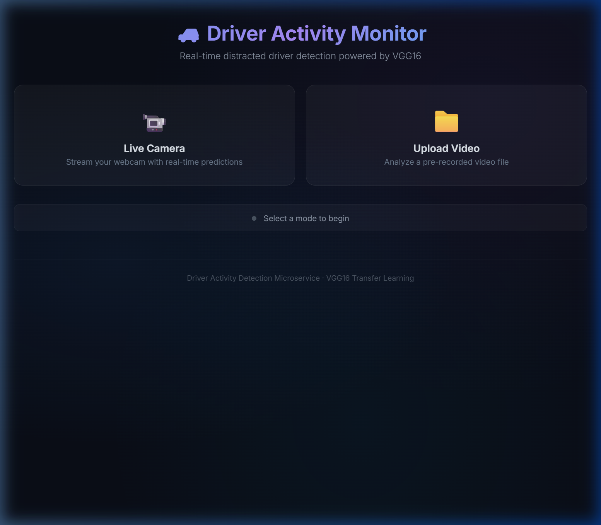

<div align="center">

# 🚗 Driver Activity Monitor

**Real-time distracted driver detection powered by a VGG16 Transfer Learning model.**

[](https://www.python.org/)
[](https://flask.palletsprojects.com/)
[](https://tensorflow.org/)
[](https://opencv.org/)
[](https://www.docker.com/)



</div>

## 📌 Overview

This project implements a Convolutional Neural Network (based on **VGG16**) to classify a driver's behavior and determine if they are driving safely, texting, talking on the phone, reaching behind, etc.

The repository includes the training pipeline as well as a **fully containerized Flask Microservice** that provides a sleek, dark-themed web interface for real-time inference via webcam or uploaded video.

---

## ✨ Key Features

- **Real-Time Video Inference**: Analyzes live webcam feeds using OpenCV and outputs predictions directly onto the frames.
- **Video Upload Support**: Allows users to upload pre-recorded MP4/AVI videos for frame-by-frame analysis.
- **Transfer Learning (VGG16)**: Built on top of VGG16 with custom dense headers, reducing training time while maintaining high accuracy.
- **Deployable Microservice**: A standalone Flask application (`prediction_service/`) packaged with a Dockerfile for instant deployment anywhere.

---

## 📂 Project Structure

```text
Ml_Project/
├── prediction_service/       # The deployable Web Microservice
│   ├── app.py                # Flask server
│   ├── model/                # Contains the .h5 model file
│   ├── templates/            # HTML Web UI 
│   ├── Dockerfile            # Containerization instructions
│   └── requirements.txt      # Microservice dependencies
├── src/                      # Source Code
│   ├── training/             # Model training & fine-tuning scripts
│   └── inference/            # Headless prediction & WSL layer scripts
├── media/                    # Screenshots and assets
├── data/                     # (Ignored) Raw datasets
└── notebooks/                # Jupyter Notebooks for exploration
```

---

## 🚀 Getting Started (Microservice)

Because the pre-trained `best_model_finetuned_v1.h5` model file is larger than 100MB, it is ignored by Git. **You must download the model and place it in the `prediction_service/model/` directory before running the app.**

### Option 1: Run Locally (Windows/Native)
*(Recommended if you want to use the Live Webcam feature, as Docker/WSL blocks native camera access)*

1. Navigate to the microservice folder:
   ```bash
   cd prediction_service
   ```
2. Install the required packages:
   ```bash
   pip install -r requirements.txt
   ```
3. Start the Flask server:
   ```bash
   python app.py
   ```
4. Open your browser and go to: **http://127.0.0.1:5000**

### Option 2: Run via Docker
*(Recommended for deployment on cloud servers)*

1. Navigate to the microservice folder:
   ```bash
   cd prediction_service
   ```
2. Build the Docker image:
   ```bash
   docker build -t driver-activity-service .
   ```
3. Run the container:
   ```bash
   docker run -p 5000:5000 driver-activity-service
   ```

---

## 🧠 Training Your Own Model

If you wish to retrain the model on new data:

1. Place your dataset inside the `data/` folder.
2. Run the header training script (trains only the densely connected classifier):
   ```bash
   python src/training/Header_layer_train.py
   ```
3. To fine-tune the entire VGG16 base (unlocking deeper layers):
   ```bash
   python src/training/Fine_tune.py
   ```
4. Move the resulting `.h5` model into `prediction_service/model/` to serve it via the web app.

---

## 💻 Tech Stack
- **Deep Learning**: TensorFlow, Keras
- **Computer Vision**: OpenCV (cv2)
- **Backend Service**: Flask, Werkzeug
- **Frontend**: HTML5, Vanilla CSS, JavaScript
- **Deployment**: Docker
